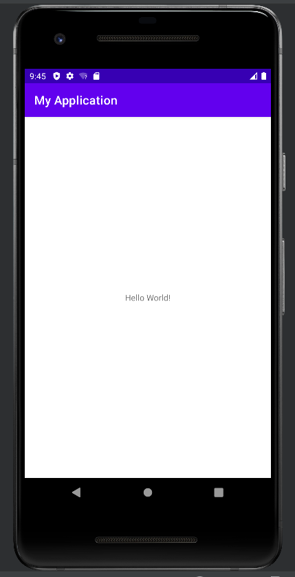
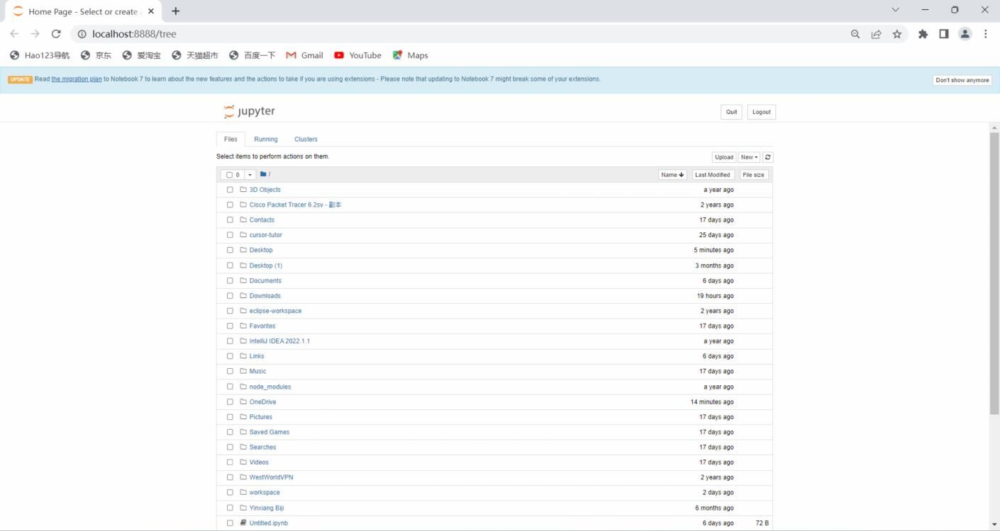
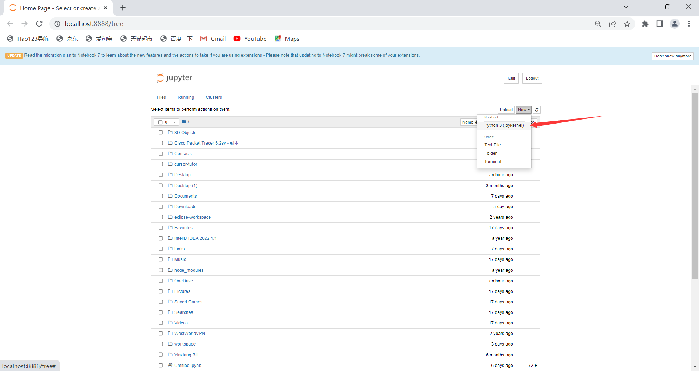
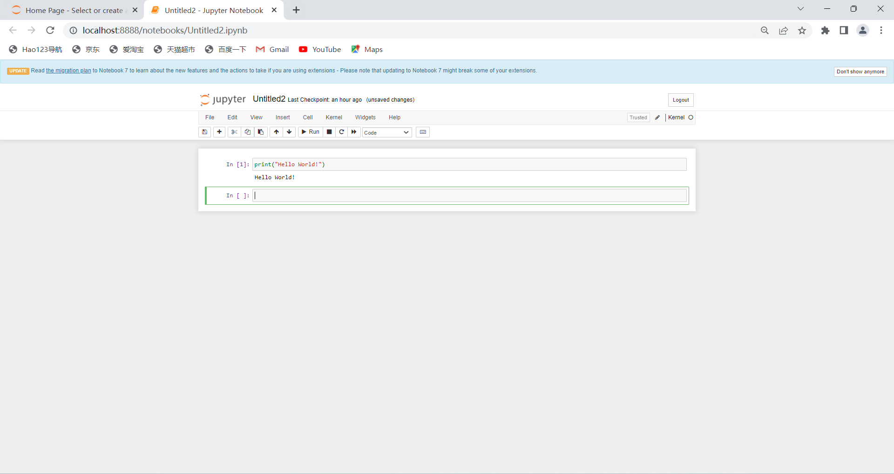
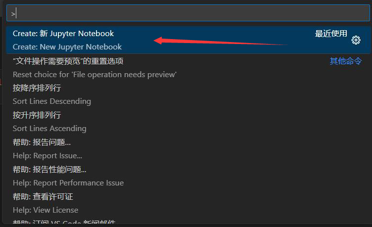
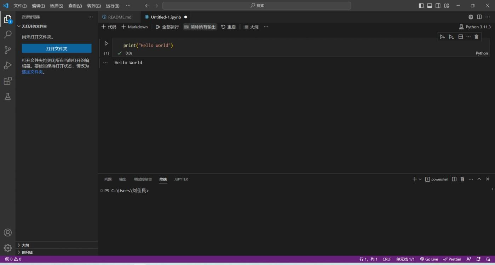

# 实验一 相关软件安装  
### 1.Android Studio  
#### 创建第一个Kotlin安卓文件  
①File -> New -> New Project -> Basic Activity -> Next -> 命名AndroidLab01 ->language选择Kotlin语言-> Finish  

②res -> layout -> activity_main.xml  

③插入一个text view居中显示，内容为hello world！，文字内容通过@string关联values->strings.xml内的文字展现  

##### 关键代码  

```
<TextView    android:layout_width="wrap_content"    android:layout_height="wrap_content"    android:text="@string/text"    app:layout_constraintBottom_toBottomOf="parent"    app:layout_constraintEnd_toEndOf="parent"    app:layout_constraintStart_toStartOf="parent"    app:layout_constraintTop_toTopOf="parent" />
```
##### 效果截图  

  

### 2.Anaconda  

  

### 3.Jupyter NoteBook  

  

① New -> Python 3文件    

   

② 打印输出Hello World!  

  

### 4.VScode运行Jupyter NoteBook  

① 搜索栏输入>新建一个Jupyter NoteBook  

  

② 打印输出Hello World!  

  