# 实验二 
### 2.1 实现第一个Kotlin应用
#### 思路与代码

 ①File->New->New Project->Basic Activity->选择Kotlin语言->finish
 
 ②修改第一个页面文件：fragment_first.xml
在values>colors.xml定义了一些应用程序可以使用的颜色，添加新颜色screenBackground 值为 #2196F3，这是蓝色阴影色；添加新颜色buttonBackground 值为 #BBDEFB

```
    <color name="screenBackground">#2196F3</color>  
    <color name="buttonBackground">#BBDEFB</color>
```
修改第一个页面的背景和按钮颜色
```
android:background="@color/screenBackground"
android:background="@color/buttonBackground"
```

③在第一个页面添加三个按钮与TextView底部布局关联，三个按钮关联，并修改TextView显示内容样式——字体白色、粗体、字体100dp

```
<?xml version="1.0" encoding="utf-8"?>
<androidx.constraintlayout.widget.ConstraintLayout xmlns:android="http://schemas.android.com/apk/res/android"
    xmlns:app="http://schemas.android.com/apk/res-auto"
    xmlns:tools="http://schemas.android.com/tools"
    android:layout_width="match_parent"
    android:layout_height="match_parent"
    tools:context=".FirstFragment"
    android:background="@color/screenBackground"
    >

    <TextView
        android:id="@+id/textview_first"
        android:layout_width="wrap_content"
        android:layout_height="wrap_content"
        android:fontFamily="sans-serif-condensed"
        android:text="@string/hello_first_fragment"
        android:textColor="@android:color/white"
        android:textSize="100sp"
        android:textStyle="bold"
        app:layout_constraintBottom_toBottomOf="parent"
        app:layout_constraintEnd_toEndOf="parent"
        app:layout_constraintStart_toStartOf="parent"
        app:layout_constraintTop_toTopOf="parent"
        app:layout_constraintVertical_bias="0.3" />

    <Button
        android:id="@+id/random_button"
        android:layout_width="wrap_content"
        android:layout_height="wrap_content"
        android:layout_marginEnd="24dp"
        android:background="@color/buttonBackground"
        android:text="@string/random_button_text"
        app:layout_constraintBottom_toBottomOf="parent"
        app:layout_constraintEnd_toEndOf="parent"
        app:layout_constraintTop_toBottomOf="@+id/textview_first" />

    <Button
        android:id="@+id/toast_button"
        android:layout_width="wrap_content"
        android:layout_height="wrap_content"
        android:layout_marginStart="24dp"
        android:background="@color/buttonBackground"
        android:text="@string/toast_button_text"
        app:layout_constraintBottom_toBottomOf="parent"
        app:layout_constraintStart_toStartOf="parent"
        app:layout_constraintTop_toBottomOf="@+id/textview_first" />

    <Button
        android:id="@+id/count_button"
        android:layout_width="wrap_content"
        android:layout_height="wrap_content"
        android:text="@string/count_button_text"
        app:layout_constraintBottom_toBottomOf="parent"
        app:layout_constraintEnd_toStartOf="@+id/random_button"
        app:layout_constraintStart_toEndOf="@+id/toast_button"
        app:layout_constraintTop_toBottomOf="@+id/textview_first"
        android:background="@color/buttonBackground"
        />
</androidx.constraintlayout.widget.ConstraintLayout>
```
在Strings.xml内添加文本属性
```
 <string name="hello_first_fragment">0</string>
 <string name="toast_button_text">Toast</string>
 <string name="random_button_text">Random</string>
 <string name="count_button_text">Count</string>
```

④为Toast按钮添加一个toast信息
打开FirstFragment.kt文件，有三个方法：onCreateView，onViewCreated和onDestroyView，在onViewCreated方法中使用绑定机制设置按钮的响应事件
```
binding.randomButton.setOnClickListener {
    findNavController().navigate(R.id.action_FirstFragment_to_SecondFragment)
}
```

接下来，为TOAST按钮添加事件，使用findViewById()查找按钮id
```
// find the toast_button by its ID and set a click listener
view.findViewById<Button>(R.id.toast_button).setOnClickListener {
   // create a Toast with some text, to appear for a short time
   val myToast = Toast.makeText(context, "Hello Toast!", Toast.LENGTH_LONG)
   // show the Toast
   myToast.show()
}
```
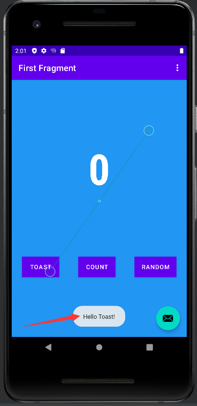  

⑤使Count按钮更新屏幕的数字
此步骤向Count按钮添加事件响应，更新Textview的文本显示。在FirstFragment.kt文件，为count_buttion按钮添加事件：
```
view.findViewById<Button>(R.id.count_button).setOnClickListener {
   countMe(view)
}
```
countMe()为自定义方法，以View为参数，每次点击增加数字1，具体代码为：
```
private fun countMe(view: View) {
   // Get the text view
   val showCountTextView = view.findViewById<TextView>(R.id.textview_first)

   // Get the value of the text view.
   val countString = showCountTextView.text.toString()

   // Convert value to a number and increment it
   var count = countString.toInt()
   count++

   // Display the new value in the text view.
   showCountTextView.text = count.toString()
}

```
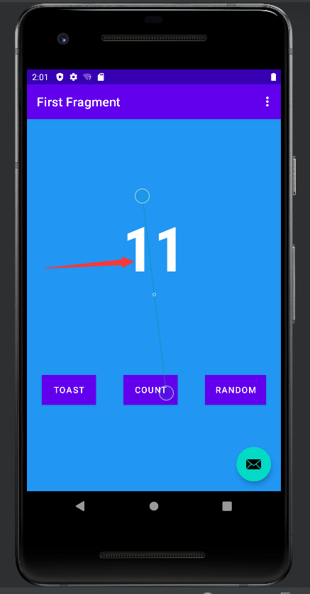  
⑥修改第二个页面：fragment_second.xml,显示来自第一个页面的随机数，添加顶部TextView动态展示来自前一个页面Count计算出的数，居中TextView显示0-Count之间的随机数，preview按钮返回上一个页面
```
<?xml version="1.0" encoding="utf-8"?>
<androidx.constraintlayout.widget.ConstraintLayout xmlns:android="http://schemas.android.com/apk/res/android"
    xmlns:app="http://schemas.android.com/apk/res-auto"
    xmlns:tools="http://schemas.android.com/tools"
    android:layout_width="match_parent"
    android:layout_height="match_parent"
    tools:context=".SecondFragment"
    android:background="@color/screenBackground2">

    <TextView
        android:id="@+id/textview_header"
        android:layout_width="0dp"
        android:layout_height="wrap_content"
        android:layout_marginStart="24dp"
        android:layout_marginLeft="24dp"
        android:layout_marginTop="24dp"
        android:layout_marginEnd="24dp"
        android:layout_marginRight="24dp"
        android:text="@string/random_heading"
        android:textColor="@color/colorPrimaryDark"
        android:textSize="24sp"
        app:layout_constraintEnd_toEndOf="parent"
        app:layout_constraintStart_toStartOf="parent"
        app:layout_constraintTop_toTopOf="parent" />


    <TextView
        android:id="@+id/textview_random"
        android:layout_width="wrap_content"
        android:layout_height="wrap_content"
        android:text="R"
        android:textColor="@android:color/white"
        android:textSize="72sp"
        android:textStyle="bold"
        app:layout_constraintBottom_toTopOf="@+id/button_second"
        app:layout_constraintEnd_toEndOf="parent"
        app:layout_constraintStart_toStartOf="parent"
        app:layout_constraintTop_toBottomOf="@+id/textview_header"
        app:layout_constraintVertical_bias="0.45" />


    <Button
        android:id="@+id/button_second"
        android:layout_width="wrap_content"
        android:layout_height="wrap_content"
        android:text="@string/previous"
        app:layout_constraintBottom_toBottomOf="parent"
        app:layout_constraintEnd_toEndOf="parent"
        app:layout_constraintHorizontal_bias="0.498"
        app:layout_constraintStart_toStartOf="parent"
        app:layout_constraintTop_toBottomOf="@id/textview_header"
        app:layout_constraintVertical_bias="0.973" />
</androidx.constraintlayout.widget.ConstraintLayout>
```
Strings.xml和colors.xml文件内添加相应资源文件
```
<string name="previous">Previous</string>
<string name="random_heading">Here is a random number between 0 and %d.</string>
<color name="colorPrimaryDark">#3700B3</color>
    <color name="screenBackground2">#26C6DA</color>
```
⑦启用SafeArgs
首先打开 Gradle Scripts > build.gradle (Project: My First App),在plugins添加
```
id 'androidx.navigation.safeargs' version '2.5.2' apply false
```
接着打开 Gradle Scripts > build.gradle (Module: app),
在plugins节添加
```
id 'androidx.navigation.safeargs'
```
sync project with gradle files

⑧创建导航动作参数
点击Arguments + 符号
弹出的对话框中，添加参数myArg，类型为整型Integer

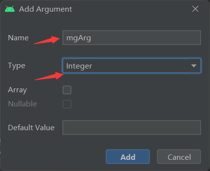


⑨FirstFragment添加代码，向SecondFragment发数据
打开FirstFragment.kt源代码文件找到onViewCreated()方法，该方法在onCreateView方法之后被调用，可以实现组件的初始化。
找到Random按钮的响应代码，获取TextView中文本并转换为整数值,
将currentCount作为参数传递给actionFirstFragmentToSecondFragment(),
findNavController().navigate(action)
```
binding.randomButton.setOnClickListener {
            //findNavController().navigate(R.id.action_FirstFragment_to_SecondFragment)
            val showCountTextView = view.findViewById<TextView>(R.id.textview_first)
            val currentCount = showCountTextView.text.toString().toInt()
            val action = FirstFragmentDirections.actionFirstFragmentToSecondFragment(currentCount)
            findNavController().navigate(action)
        }
```
添加SecondFragment的代码

导入navArgs包
```
import androidx.navigation.fragment.navArgs
```
onViewCreated()代码之前添加一行
```
val args: SecondFragmentArgs by navArgs()
```

onViewCreated()中获取传递过来的参数列表，提取count数值，并在textview_header中显示,根据count值生成随机数,textview_random中显示count值
```
val count = args.myArg
        val countText = getString(R.string.random_heading, count)
        view.findViewById<TextView>(R.id.textview_header).text = countText
        val random = java.util.Random()
        var randomNumber = 0
        if (count > 0) {
            randomNumber = random.nextInt(count + 1)
        }
        view.findViewById<TextView>(R.id.textview_random).text = randomNumber.toString()
```

#### 实验结果
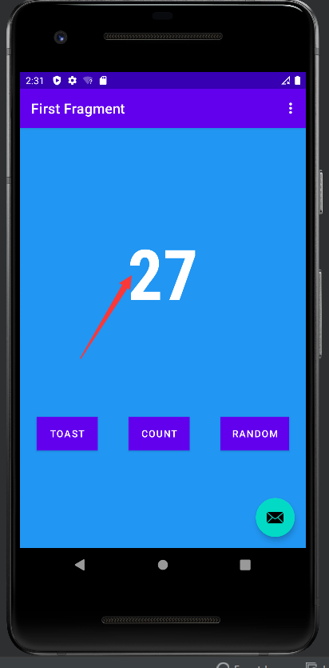  
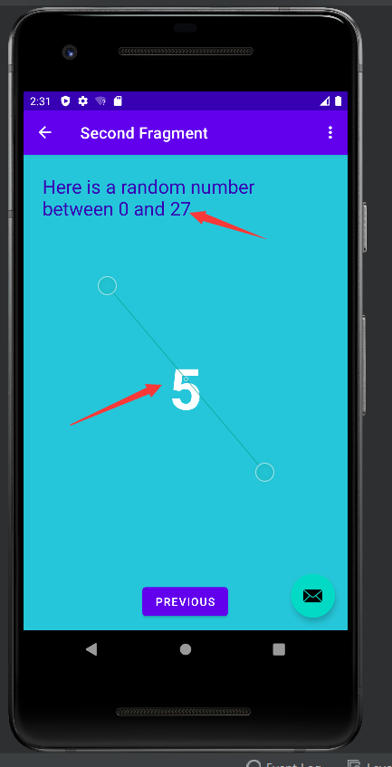  

### 2.2构建CameraX应用
#### 思路与代码
①新建project添加gradle依赖
```
def camerax_version = "1.1.0-beta01"
    implementation "androidx.camera:camera-core:${camerax_version}"
    implementation "androidx.camera:camera-camera2:${camerax_version}"
    implementation "androidx.camera:camera-lifecycle:${camerax_version}"
    implementation "androidx.camera:camera-video:${camerax_version}"

    implementation "androidx.camera:camera-view:${camerax_version}"
    implementation "androidx.camera:camera-extensions:${camerax_version}"
```
因为在项目中使用了ViewBinding，在 android{} 代码块末尾添加如下代码：
```
buildFeatures {
   viewBinding true
}
```
sync project with gradle files

②创建项目布局
main_activity.xml放置用于控制图片拍摄的标准按钮。用于开始/停止视频拍摄的标准按钮。
```
<?xml version="1.0" encoding="utf-8"?>
<androidx.constraintlayout.widget.ConstraintLayout xmlns:android="http://schemas.android.com/apk/res/android"
    xmlns:app="http://schemas.android.com/apk/res-auto"
    xmlns:tools="http://schemas.android.com/tools"
    android:layout_width="match_parent"
    android:layout_height="match_parent"
    tools:context=".MainActivity">

    <androidx.camera.view.PreviewView
        android:id="@+id/viewFinder"
        android:layout_width="match_parent"
        android:layout_height="match_parent" />

    <Button
        android:id="@+id/image_capture_button"
        android:layout_width="110dp"
        android:layout_height="110dp"
        android:layout_marginBottom="50dp"
        android:layout_marginEnd="50dp"
        android:elevation="2dp"
        android:text="@string/take_photo"
        app:layout_constraintBottom_toBottomOf="parent"
        app:layout_constraintLeft_toLeftOf="parent"
        app:layout_constraintEnd_toStartOf="@id/vertical_centerline" />

    <Button
        android:id="@+id/video_capture_button"
        android:layout_width="110dp"
        android:layout_height="110dp"
        android:layout_marginBottom="50dp"
        android:layout_marginStart="50dp"
        android:elevation="2dp"
        android:text="@string/start_capture"
        app:layout_constraintBottom_toBottomOf="parent"
        app:layout_constraintStart_toEndOf="@id/vertical_centerline" />

    <androidx.constraintlayout.widget.Guideline
        android:id="@+id/vertical_centerline"
        android:layout_width="wrap_content"
        android:layout_height="wrap_content"
        android:orientation="vertical"
        app:layout_constraintGuide_percent=".50" />

</androidx.constraintlayout.widget.ConstraintLayout>
```
更新Strings.xml文件
```
<resources>
    <string name="app_name">CameraXApp</string>
    <string name="take_photo">Take Photo</string>
    <string name="start_capture">Start Capture</string>
    <string name="stop_capture">Stop Capture</string>
</resources>
```
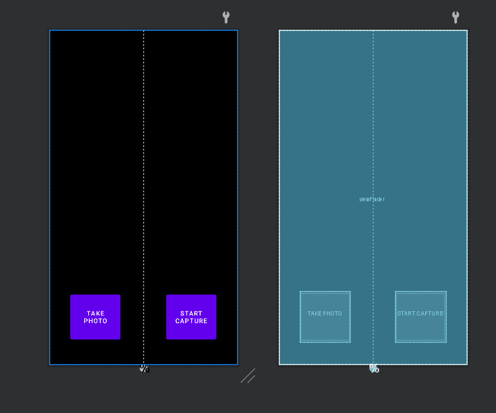

③编写 MainActivity.kt 代码
```

typealias LumaListener = (luma: Double) -> Unit

class MainActivity : AppCompatActivity() {
   private lateinit var viewBinding: ActivityMainBinding

   private var imageCapture: ImageCapture? = null

   private var videoCapture: VideoCapture<Recorder>? = null
   private var recording: Recording? = null

   private lateinit var cameraExecutor: ExecutorService

   override fun onCreate(savedInstanceState: Bundle?) {
       super.onCreate(savedInstanceState)
       viewBinding = ActivityMainBinding.inflate(layoutInflater)
       setContentView(viewBinding.root)

       // Request camera permissions
       if (allPermissionsGranted()) {
           startCamera()
       } else {
           ActivityCompat.requestPermissions(
               this, REQUIRED_PERMISSIONS, REQUEST_CODE_PERMISSIONS)
       }

       // Set up the listeners for take photo and video capture buttons
       viewBinding.imageCaptureButton.setOnClickListener { takePhoto() }
       viewBinding.videoCaptureButton.setOnClickListener { captureVideo() }

       cameraExecutor = Executors.newSingleThreadExecutor()
   }

   private fun takePhoto() {}

   private fun captureVideo() {}

   private fun startCamera() {}

   private fun allPermissionsGranted() = REQUIRED_PERMISSIONS.all {
       ContextCompat.checkSelfPermission(
           baseContext, it) == PackageManager.PERMISSION_GRANTED
   }

   override fun onDestroy() {
       super.onDestroy()
       cameraExecutor.shutdown()
   }

   companion object {
       private const val TAG = "CameraXApp"
       private const val FILENAME_FORMAT = "yyyy-MM-dd-HH-mm-ss-SSS"
       private const val REQUEST_CODE_PERMISSIONS = 10
       private val REQUIRED_PERMISSIONS =
           mutableListOf (
               Manifest.permission.CAMERA,
               Manifest.permission.RECORD_AUDIO
           ).apply {
               if (Build.VERSION.SDK_INT <= Build.VERSION_CODES.P) {
                   add(Manifest.permission.WRITE_EXTERNAL_STORAGE)
               }
           }.toTypedArray()
   }
}

```
④在manifest.xml设置必要权限，插入到application之前
```
<uses-feature android:name="android.hardware.camera.any" />
    <uses-permission android:name="android.permission.CAMERA" />
    <uses-permission android:name="android.permission.RECORD_AUDIO" />
    <uses-permission android:name="android.permission.WRITE_EXTERNAL_STORAGE"
        android:maxSdkVersion="28" />
```
在MainActivity.kt插入如下代码判断是否已授予权限，若是则调用 startCamera() （进行预览）；如果未授予权限，系统会显示一个消息框，通知用户未授予权限。
```
override fun onRequestPermissionsResult(
   requestCode: Int, permissions: Array<String>, grantResults:
   IntArray) {
   if (requestCode == REQUEST_CODE_PERMISSIONS) {
       if (allPermissionsGranted()) {
           startCamera()
       } else {
           Toast.makeText(this,
               "Permissions not granted by the user.",
               Toast.LENGTH_SHORT).show()
           finish()
       }
   }
}
```
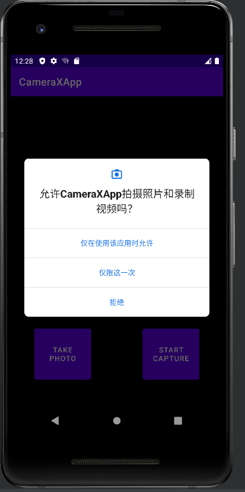  
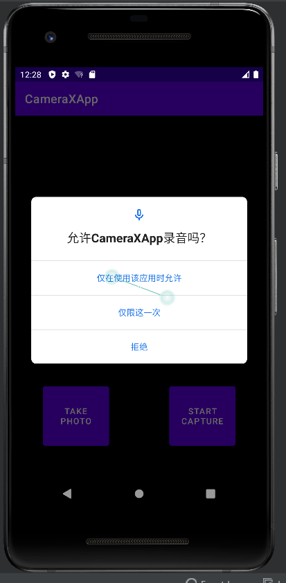  
⑤补充startCamera函数,让用户预览他们拍摄的照片
```
private fun startCamera() {
        val cameraProviderFuture = ProcessCameraProvider.getInstance(this)

        cameraProviderFuture.addListener({
            // Used to bind the lifecycle of cameras to the lifecycle owner
            val cameraProvider: ProcessCameraProvider = cameraProviderFuture.get()

            // Preview
            val preview = Preview.Builder()
                .build()
                .also {
                    it.setSurfaceProvider(viewBinding.viewFinder.surfaceProvider)
                }
            /*imageCapture = ImageCapture.Builder()
                .build()*/
            // Select back camera as a default
            val recorder = Recorder.Builder()
                .setQualitySelector(QualitySelector.from(Quality.HIGHEST))
                .build()
            videoCapture = VideoCapture.withOutput(recorder)
            val cameraSelector = CameraSelector.DEFAULT_BACK_CAMERA

            try {
                // Unbind use cases before rebinding
                cameraProvider.unbindAll()

                // Bind use cases to camera
                cameraProvider.bindToLifecycle(
                    this, cameraSelector, preview, /*imageCapture*/videoCapture)

            } catch(exc: Exception) {
                Log.e(TAG, "Use case binding failed", exc)
            }

        }, ContextCompat.getMainExecutor(this))
    }
```
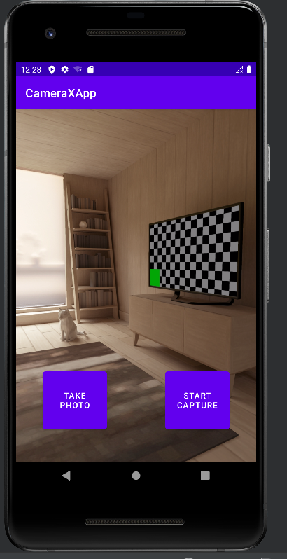  

⑥补充takephoto函数，实现拍照功能
```
private fun takePhoto() {
        // Get a stable reference of the modifiable image capture use case
        val imageCapture = imageCapture ?: return

        // Create time stamped name and MediaStore entry.
        val name = SimpleDateFormat(FILENAME_FORMAT, Locale.US)
            .format(System.currentTimeMillis())
        val contentValues = ContentValues().apply {
            put(MediaStore.MediaColumns.DISPLAY_NAME, name)
            put(MediaStore.MediaColumns.MIME_TYPE, "image/jpeg")
            if(Build.VERSION.SDK_INT > Build.VERSION_CODES.P) {
                put(MediaStore.Images.Media.RELATIVE_PATH, "Pictures/CameraX-Image")
            }
        }

        // Create output options object which contains file + metadata
        val outputOptions = ImageCapture.OutputFileOptions
            .Builder(contentResolver,
                MediaStore.Images.Media.EXTERNAL_CONTENT_URI,
                contentValues)
            .build()

        // Set up image capture listener, which is triggered after photo has
        // been taken
        imageCapture.takePicture(
            outputOptions,
            ContextCompat.getMainExecutor(this),
            object : ImageCapture.OnImageSavedCallback {
                override fun onError(exc: ImageCaptureException) {
                    Log.e(TAG, "Photo capture failed: ${exc.message}", exc)
                }

                override fun
                        onImageSaved(output: ImageCapture.OutputFileResults){
                    val msg = "Photo capture succeeded: ${output.savedUri}"
                    Toast.makeText(baseContext, msg, Toast.LENGTH_SHORT).show()
                    Log.d(TAG, msg)
                }
            }
        )
    }
```
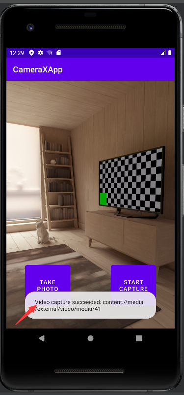  
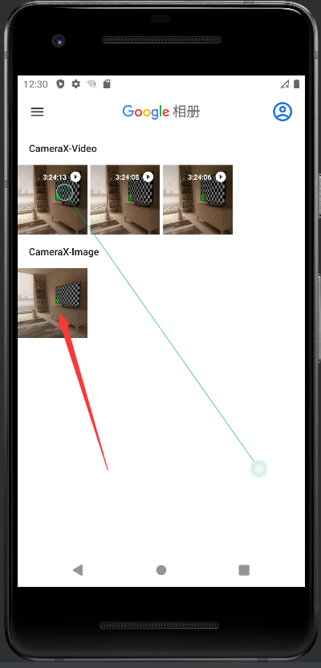

⑦补充capturevideo函数，实现录制视频功能
```
private fun captureVideo() {
        val videoCapture = this.videoCapture ?: return

        viewBinding.videoCaptureButton.isEnabled = false

        val curRecording = recording
        if (curRecording != null) {
            // Stop the current recording session.
            curRecording.stop()
            recording = null
            return
        }

        // create and start a new recording session
        val name = SimpleDateFormat(FILENAME_FORMAT, Locale.US)
            .format(System.currentTimeMillis())
        val contentValues = ContentValues().apply {
            put(MediaStore.MediaColumns.DISPLAY_NAME, name)
            put(MediaStore.MediaColumns.MIME_TYPE, "video/mp4")
            if (Build.VERSION.SDK_INT > Build.VERSION_CODES.P) {
                put(MediaStore.Video.Media.RELATIVE_PATH, "Movies/CameraX-Video")
            }
        }

        val mediaStoreOutputOptions = MediaStoreOutputOptions
            .Builder(contentResolver, MediaStore.Video.Media.EXTERNAL_CONTENT_URI)
            .setContentValues(contentValues)
            .build()
        recording = videoCapture.output
            .prepareRecording(this, mediaStoreOutputOptions)
            .apply {
                if (PermissionChecker.checkSelfPermission(this@MainActivity,
                        Manifest.permission.RECORD_AUDIO) ==
                    PermissionChecker.PERMISSION_GRANTED)
                {
                    withAudioEnabled()
                }
            }
            .start(ContextCompat.getMainExecutor(this)) { recordEvent ->
                when(recordEvent) {
                    is VideoRecordEvent.Start -> {
                        viewBinding.videoCaptureButton.apply {
                            text = getString(R.string.stop_capture)
                            isEnabled = true
                        }
                    }
                    is VideoRecordEvent.Finalize -> {
                        if (!recordEvent.hasError()) {
                            val msg = "Video capture succeeded: " +
                                    "${recordEvent.outputResults.outputUri}"
                            Toast.makeText(baseContext, msg, Toast.LENGTH_SHORT)
                                .show()
                            Log.d(TAG, msg)
                        } else {
                            recording?.close()
                            recording = null
                            Log.e(TAG, "Video capture ends with error: " +
                                    "${recordEvent.error}")
                        }
                        viewBinding.videoCaptureButton.apply {
                            text = getString(R.string.start_capture)
                            isEnabled = true
                        }
                    }
                }
            }
    }
```
修改startCamera函数，注释掉保存图片代码，改成如下代码
```
val recorder = Recorder.Builder()
                .setQualitySelector(QualitySelector.from(Quality.HIGHEST))
                .build()
            videoCapture = VideoCapture.withOutput(recorder)
```
将 Preview + VideoCapture 用例绑定到生命周期相机。仍在 startCamera() 内，将 cameraProvider.bindToLifecycle() 调用替换为以下代码：
```
cameraProvider.bindToLifecycle(this, cameraSelector, preview, videoCapture)
```
#### 实验结果
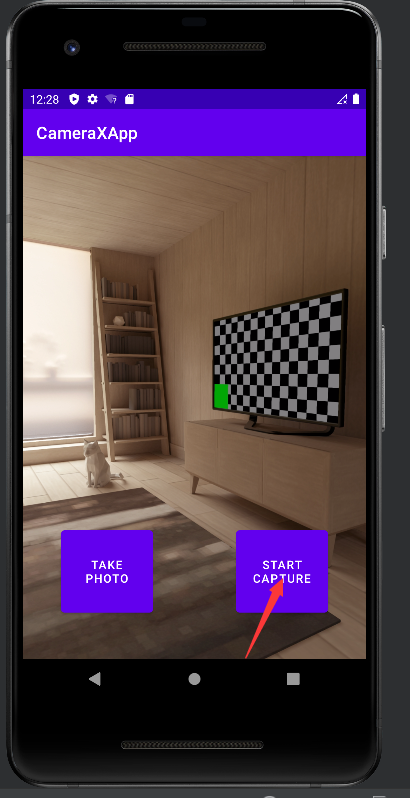  
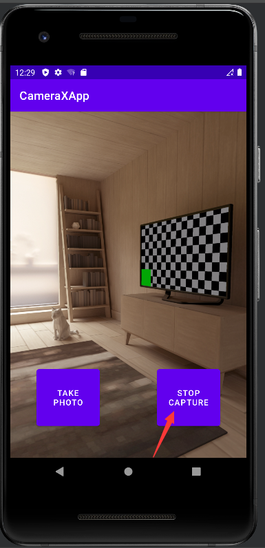  
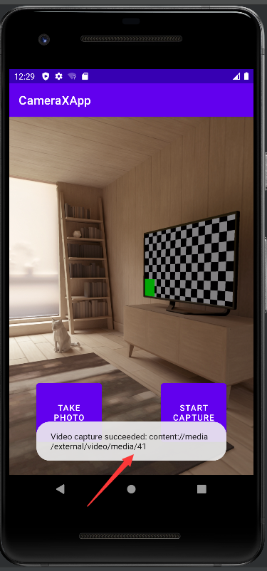  
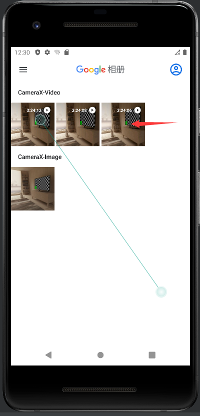


