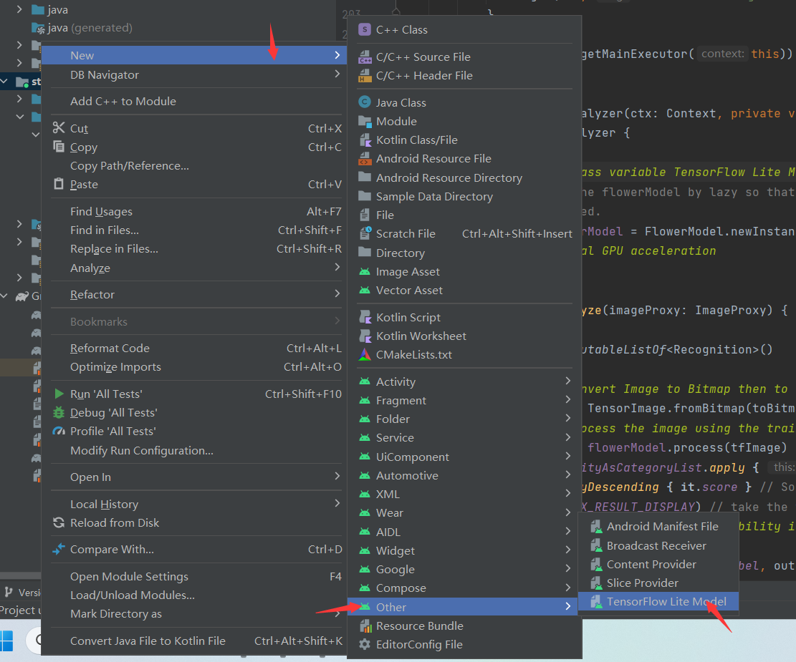
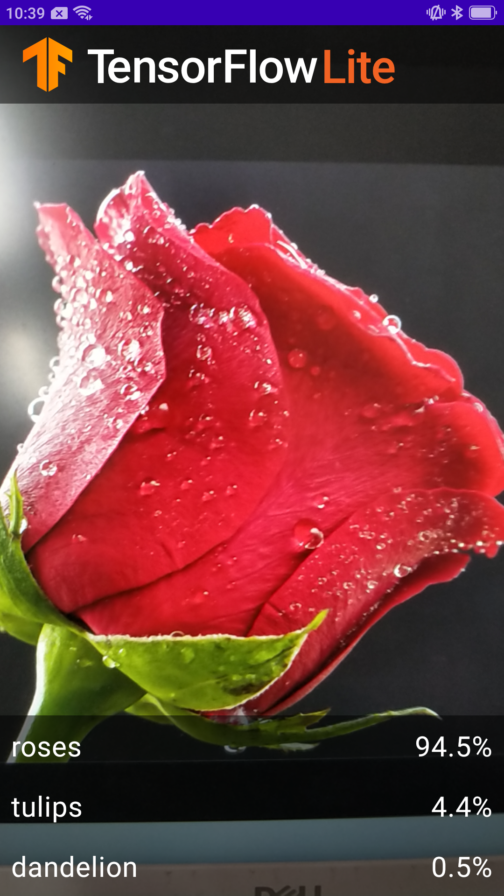

# 实验四 实现基本的图像分类APP
### 1.访问Github连接*https://github.com/hoitab/TFLClassify*下载相应代码，并解压到工作目录
  
  
### 2.运行初始代码
① 打开Android Studio，打开刚刚解压的文件夹
  
② 编译项目，下载相应依赖库  
③ 用USB连接到手机，将软件安装到实体机上  
④ 运行效果如下，三个fake label随机跳动  
 
### 3.向应用中添加TensorFlow Lite
① 选择"start"模块,右键“start”模块，或者选择File，然后New>Other>TensorFlow Lite Model
  
② 选择finish模块中ml文件下的FlowerModel.tflite
点击“Finish”完成模型导入，系统将自动下载模型的依赖包并将依赖项添加至模块的build.gradle文件。  
  
   
### 4.检查代码中TODO选项，添加代码重新运行APP
① 定位“start”模块MainActivity.kt文件的TODO 1，添加初始化训练模型的代码
```
// TODO 1: Add class variable TensorFlow Lite Model
        // Initializing the flowerModel by lazy so that it runs in the same thread when the process
        // method is called.
        private val flowerModel = FlowerModel.newInstance(ctx)
```
② 定位TODO 2在CameraX的analyze方法内部，需要将摄像头的输入ImageProxy转化为Bitmap对象，并进一步转化为TensorImage 对象
```
// TODO 2: Convert Image to Bitmap then to TensorImage
            val tfImage = TensorImage.fromBitmap(toBitmap(imageProxy))
```
③ 定位TODO 3对图像进行处理并生成结果，主要包含下述操作：按照属性score对识别结果按照概率从高到低排序列出最高k种可能的结果，k的结果由常量MAX_RESULT_DISPLAY定义
```
// TODO 3: Process the image using the trained model, sort and pick out the top results
            val outputs = flowerModel.process(tfImage)
                .probabilityAsCategoryList.apply {
                    sortByDescending { it.score } // Sort with highest confidence first
                }.take(MAX_RESULT_DISPLAY) // take the top results

```
④定位TODO 4 将识别的结果加入数据对象Recognition 中，包含label和score两个元素。后续将用于RecyclerView的数据显示
```
// TODO 4: Converting the top probability items into a list of recognitions
            for (output in outputs) {
                items.add(Recognition(output.label, output.score))
            }
```
⑤ 将原先用于虚拟显示识别结果的代码注释掉或者删除
```
// START - Placeholder code at the start of the codelab. Comment this block of code out.
            //for (i in 0 until MAX_RESULT_DISPLAY){
            //    items.add(Recognition("Fake label $i", Random.nextFloat()))
            //}
            // END - Placeholder code at the start of the codelab. Comment this block of code out.
```
⑥ 以物理设备重新运行start模块  
 
### 5.运行结果  
识别五种花卉  
①向日葵  
  
②玫瑰  
  
③雏菊  
   
④郁金香  
   
⑤蒲公英  
   
